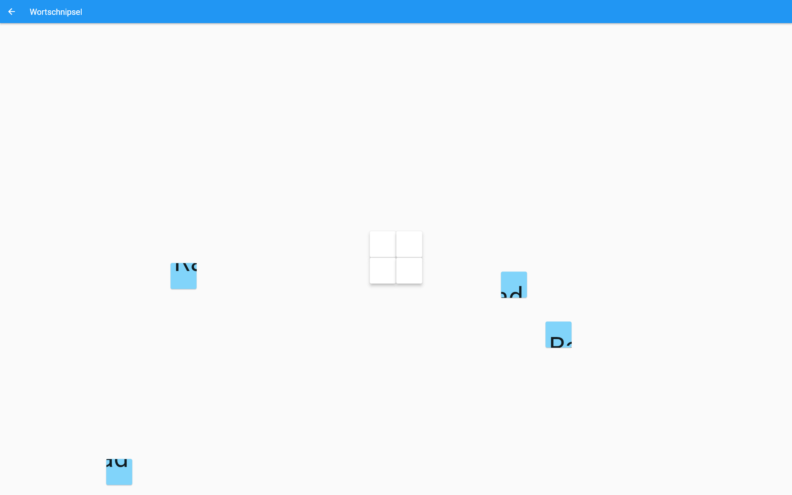

# Ausarbeitung Meilensteine
## Problemanalyse
### Analyse vorhandener Literatur
[1]Quincy Conley, Yvonne Earnshaw & Grayley McWatters (2019):
Examining Course Layouts in Blackboard: Using Eye-Tracking to Evaluate Usability in a
Learning Management System, International Journal of Human–Computer Interaction, DOI:
10.1080/10447318.2019.1644841

[2]Mispa, Khairunnisa, Evi Indriasari Mansor, and Azrina Kamaruddin. "Evaluating children's user experience (UX) towards mobile application: The fantasy land prototype." In Proceedings of the 5th International ACM In-Cooperation HCI and UX Conference, pp. 46-54. 2019.

[3]Santoso, Harry B., Martin Schrepp, R. Y. K. I. Isal, Andika Yudha Utomo, and Bilih Priyogi. "Measuring user experience of the student-centered e-learning environment." Journal of Educators Online 13, no. 1 (2016): 58-79.

[4]Zaharias, Panagiotis, and Angeliki Poylymenakou. "Developing a usability evaluation method for e-learning applications: Beyond functional usability." Intl. Journal of Human–Computer Interaction 25, no. 1 (2009): 75-98.

[5]Nakamura, Walter T., Leonardo C. Marques, Luis Rivero, Elaine HT de Oliveira, and Tayana Conte. "Are scale-based techniques enough for learners to convey their UX when using a Learning Management System?." Revista Brasileira de Informática na Educação 27, no. 1 (2019): 104-131.

Da wir eine App bauen wollen, die mit Legasthenikern ein Legasthenietraining durchgeht, fallen wir grundsätzlich einmal in die Kategorie der Lernprogramme. Da wir die App unterhaltsam gestalten wollen, haben wir uns dafür entschieden, ein wenig in die Gamification zu gehen um zu versuchen, mit klassischen Mitteln wie Levels und Belohnungen das Engagement zu halten und die Menschen dazu zu motivieren, erneut Lernübungen zu machen.
Erst einmal ist die Motivation festzulegen. Primär wird diese wohl sein, dass man darauf aufmerksam gemacht wurde sich einem Legasthenie Programm zu unterfangen, wobei dies, wenn unsere Vision des freien Zugangs funktioniert, nicht allein darauf basiert, dass man dazu gezwungen wurde, sondern auch, das man nach einer gewissen selbstdiagnose sich überlegen könnte, die Aufgaben einmal zu probieren.
Studien haben dabei gezeigt, dass ein gutes HCI Design, besonders in solchen Lernsituationen, eine Rolle spielt, da die Schüler allgemein dagegen negativ eingestellt sind und Unverständnis und Fehler in der Konstruktion noch leichter demotivieren. Deswegen werden wir uns daran setzen müssen, die erste Lektion so reibungslos und alternativlos wie möglich zu gestalten. [1] Hat gezeigt, dass sich Schüler*innen, wenn sie eine Aufgabe vor sich haben, am besten durchgehen können, wenn diese linear aufbereitet sind und solch einen Ansatz werden wir vermutlich verfolgen.
Den angegebenen Research Papers nach ist es allerdings vor allem wichtig iterativ und Test abhängig zu arbeiten. Für einen ersten Prototypen werden wir allerdings damit beginnen, die potentiellen Fragen, welche wir unseren Tester*innen geben könnte zu reverseengenieren und eine App zu bauen, welche in diesen Fragen besonders gut performen könnte. Den Quellen nach ist es vor allem wichtig, dass die Attention, Relevance, Confidence und Satisfaction von den Usern gehalten wird, damit sie sich wohl fühlen. Dazu könnten wir immersive Animationen und minimalistische Oberflächen benutzen, um den Menschen zu verdeutlichen, dass eine Lektion jetzt begonnen hat. Da viele Aufgaben auch mit Ton funktionieren, kann man davon ausgehen, dass die App mit Lautsprechern oder Kopfhörern benutzt wird und infolgedessen auch mit Audio arbeitet. Leicht vorstellbar wäre dabei eine Animation, welche das Betreten/Einsaugen in die Lektion darstellt, verbunden mit entsprechenden Soundeffekten.
Um die Relevanz und persönliche Komponente beizubehalten, könnte man dem User Wissen über das, was geschieht und wieso überliefern. Wenn man eine Lektion beginnt, kann man beispielsweise erfahren, wie das Gehirn bei Legasthenikern diese speziellen Aufgaben anders verarbeiten könnte und wie diese Aufgabe genau diesen Teil jetzt trainiert.
Damit auch die Konfidence bleibt, muss man die Levels consequent schwieriger aufbauen, indem man anfangs noch leicht vorgeht und dann zu immer schwierigeren Aufgaben kommt. Das ganz muss mit einfach visuellem und auditivem Feedback begleitet werden, welches einem nach jeder Aufgabe mitteilt, ob man diese erfolgreich abgeschlossen hat.
Um nach dem Erstellen des ersten Prototyps richtig weiter zu arbeiten, ist es immer noch wichtig, User nach Feedback zu Fragen, dazu gibt es bekannte UEQ Fragen, allerdings sind diese nicht immer zugänglich für kleinere Kinder. Da wir unsere Applikation für Kinder ab ~7 anbieten wollen, wäre es auch wichtig, Feedback von diesen einzuholen. Damit hat sich das Paper [2] beschäftigt. Daher wird dieser Fragebogen vor allem daraus bestehen, die expliziten Fragen so zu umschreiben, dass die Kinder zwischen zwei Adjektiven entscheiden müssen, welches von diesen eher ihre Erfahrung beschreiben. Beispielsweise die Frage nach der Attraktivität der Anwendung. Die Adjektive dazu wären schön und haesslich.
Da Kameras und die verwendete Software weit verbreitet sind, würde ich auch gerne die Fragebögen mit Eyetracking kombinieren, da dies das Suchverhalten von den Usern handfest wiedergibt. 
Durch eine Kombination von Fragen und Eyetracking wird es hoffentlich möglich sein, möglichst schnell an dem design weiter zu iterieren und es zu verbessern.  
(Ben)

### Analyse von Konkurrenzprodukten & der bisherigen Applikation (falls zutreffend)
Bei meiner Recherche bin ich auf 3 Anbieter gestoßen, die ebenfallst Übungen für Legasthenie anbieten. Die Links sind [LegaKids](https://legakids.net/kids/spiele), [Legasthenie-Software](https://legasthenie-software.de/cgi-bin/wwwklex.cgi) und [Legasthenie Web App](https://legasthenie.web.app/spiel/#/). 
#### Inhaltlich
Alle drei bieten Lernmöglichkeiten für Menschen mit Legasthenie an. LegaKids fokussiert sich dabei eher auf ein sehr junges Publikum und die Übungen haben die Form von Geschichten, 2D Jumpern, etc. Der Vorteil ist hierbei ganz klar. Ein Jump-and-Run ist um einiges ansprechender, als langweiliges Einfüllen von Wörtern in Textboxen. Auch die Geschichten sind vermutlich noch ansprechender als besagte Textboxen. Unsere Idee würde ebenfalls auf eine Gamification abzielen, allerdings mehr auf einem Duolingo level, da solche Ideen zwar schön sind, aber vom Aufwand her zu viel sind. Legasthenie-Software bietet eine graphisch nicht sehr ansprechende Lösung, bei der z.B. Memory oder Candy Crush ??? gespielt werden kann. Das entspricht schon eher dem, was auch wir vorhaben, ist aber immer noch zu unterschiedlich und es fehlt mir die Gewissheit, dass das auch eine wissenschaftliche Basis hat. Legasthenie Web App bietet in einer simplen "default android" Graphik verschiedene Lernspiele (z.B. Buchstaben hören oder Wortsuche) an. Hier hätte ich als Laie am ehesten das Vertrauen, dass das auf Wissenschaft fundiert ist.  
Allen fehlt allerdings eine gewisse "Personalisierung", die es bei unserer App auf jeden Fall geben soll (z.B. Teilleistungsschwächen auswählen). Außerdem fehlt eine Begründung, warum das was man da macht auch etwas bewirkt. Sollte ich eine solche App benutzen müssen, würde ich mich nicht darauf verlassen, dass diese Lösungen funktionieren - ein Aspekt, den es bei uns auf jeden Fall geben soll. Einen Vorteil, den alle drei Möglichkeiten uns gegenüber haben, ist die Vielfältigkeit, die wir von Anfang an so auf jeden Fall nicht haben werden, da ja alles auch programmiert und mit Content gefüllt werden muss.

### UI/UX

Das User Interface bei Lega Kids erinnert stark an diese Typischen Kinder-Spiel-Seiten und das passt, da es genau so was auch ist. Das heißt nicht, dass ich das auch gut heiße, aber die Zielgruppe ist auch jünger als ich und spricht vielleicht besser auf diese grün/orange Header Layout an. Was auf jeden Fall unpraktisch und vermutlich auf ein "Fehler" ist, ist der kleine "Bild im Bild" Screen. Das lenkt nur ab (unten gibt es auch die Leiste mit alternativen Spielen) und verhindert eine Nutzung von 70% des Screens. Features wie scrollen bei Text im Spiel gibt es nicht, wobei das auch wieder nicht unbedingt schlecht sein muss, da die Zielgruppe von so etwas vielleicht verwirrt wäre. Hilfe gibt es bei diesem Spiel auch klar durch ein "?" gekenzeichnet. Einzig das Error-Feedback (e.g. wenn man was falsches anklickt) ist zu schwach und müsste vielleicht noch durch ein rotes Aufleuchten odgl. erweitert werden. 

Hier fehlt auf jeden Fall jegliches Gefühl für Design. Die Website hat vermutlich insgesamt 5 Zeilen Css, den eigentlich alles ist einfach ein default Test/Hyperlink. Das würde meine Spaß (als Kind und Jugendlicher) auf jeden Fall minimieren, wenn nicht sogar auslöschen und da Motivation für so etwas sehr wichtig ist, ist das nicht sonderlich ideal. Das Design der Spiele ist ähnlich undurchdacht bzw. einfach nicht vorhanden und trägt auch nicht wirklich zum Spaß am Lernen bei. Außerdem wird die UX durch teils schwere Bugs (Spiel geht einfach nicht weiter und das Layout ist falsch) stark gesenkt. Anstatt eine große Anzahl an Spielen anzubieten, hätten sich die Macher eher auch auf Design fokussieren sollen. Und eine kleine Anmerkung zum Schluss: Die Möglichkeit, die Übungen auf Englisch zu machen ist ganz am Ende der Seite auf Deutsch und ohne Fahne etc. 

Die meiner Meinung nach beste Alternative der drei zeichnet sich durch ein sehr simples default Design aus. Das ist zwar nicht super, aber verglichen zu den anderen Alternativen bereits eine super Leistung. Es gibt zwar nicht immer eine Erklärung, aber dort, wo sie nötig ist, gibt es sie. Eine Möglichkeit den Fortschritt zu speichern gibt es und auch Statistiken für eben jenen kann man einsehen. Einzig eine stärkerer Fokussierung auf "Lektionen" und nicht einfach immer weiter machen, wäre schön. Auch wenn ich das jetzt in den Himmel lobe, kann es gut sein, dass eine jüngere Zielgruppe (Volksschule) von dem sehr gelangweilt wird und ich kann mir auch selber nicht vorstellen, in diesem Programm täglich für mehrere Stunden zu versinken, da es dafür halt doch wirklich zu einfach gehalten wurde.  
(Julian H.)

### Nutzer:innenanalyse und Kontextanalyse

#### Nutzer:innenanalyse

Die App soll sowohl alle Altersgruppen als auch Geschlechtsgruppen in unsere Zielgruppe mit hineinbeziehen und richtet sich wie gesagt hauptsächlich an LegasthenikerInnen. Legasthenie ist eine Lese-Rechtschreibstörung, bei der betroffene Personen Schwierigkeiten beim Erlernen von Lese- und/oder Schreibfähigkeiten haben. Die WHO unterscheidet hierbei folgende Kategorien: Lese- und Rechtschreibstörung, isolierte Rechtschreibstörung und isolierte Lesestörung. Diese Lese- und Schreibfähigkeiten kann man mithilfe von Trainingsprogrammen verbessern und anschließend weiter ausbauen. Für den Anfang sollen diese Trainingsprogramme auf {Betriebssystem? bzw. Gerät?} erhältlich sein.

Es wird davon ausgegangen, dass die meisten Legastheniker ihre Lese- und Rechtschreibfähigkeiten verbessern wollen. Verschiedene Apps bieten hierbei eine Vielzahl an Aufgaben und können den Fortschritt erheblich verschnellern. Allerdings weisen die Apps, die sich der liebe Julian H bis jetzt angeschaut hat, ein schlechtes Design oder eine nicht sehr effiziente Nutzung des gesamten Bildschirmes auf. Daher wollen wir eine App entwickeln, die den Usability Heuristics und den Bedürfnissen der NutzerInnen entsprechen. Es führen viele Wege nach Rom. Man kann jedoch auch einen kürzeren und angenehmeren Weg nehmen, indem man sich für unsere in Zukunft einwandfrei entwickelte App entscheidet, um schneller ans Ziel zu gelangen.

Die Website [https://www.sabinejokischlernstraat.com/legasthenie-uebungen/](https://www.sabinejokischlernstraat.com/legasthenie-uebungen/) behandelt bezüglich der Aufgaben die AFS-Methode. Diese wird aus Aufmerksamkeitstraining, Funktionstraining und Symptomtraining zusammengesetzt und enthält mehrere Übungen bzw. Übungsbereiche, welche einer Kategorie zugeordnet werden können. Die folgende Tabelle zeigt mehrere Übungen/Übungsbereiche und ihre Kategorie an:

| Aufmerksamkeitstraining | Funktionstraining | Symptomtraining |
|:-|:-|:-|
| Phantasiereisen | Akustik | ABC Training |
| Autogenes Training | Kinästhetik | Wortbild |
| Edu-Kinästhetik | Serialität | Wortklang |
| Geschicklichkeitsübungen | Intermodalität | Wortbedeutung |
| Malen mit Hintergrundmusik | Optik | Lesetechnik |
|  |  | Lerntechnik |
|  |  | PC |

Da die Aufmerksamkeitsspanne von Person zu Person variiert, wird es von Vorteil sein, wenn der Nutzer bzw. die Nutzerin ein ordentliches Design zu Gesicht bekommt. Zusätzlich soll man bei der Nutzung des Programms keine Schwierigkeiten haben und mit verständlichen Symbolen zurrechtkommen. Eine Idee wäre die Implementierung eines einfachen Guides beim Einstieg in das Programm oder eines Hilfe-Buttons, welcher während der Nutzung immer sichtbar sein wird. Dies kann nebenbei dabei helfen die User Retention aufrechtzuerhalten und auch die Zufriedenheit der NutzerInnen erhöhen. Des Weiteren sollen In-Game Belohnungen die NutzerInnen dazu motivieren weiter am Ball zu bleiben und eventuell Fortschrittsbalken in das Programm integrieren, um auf den eigenen Fortschritt zurückblicken zu können.

Damit sich die App stetig weiterentwickeln kann, wollen nicht nur Feedback an unsere NutzerInnen geben, sondern auch Feedback von ihnen erhalten, um auf ihre Wünsche und Bedürfnisse eingehen zu können. Das Feedback sollte dann Fragen in Bezug auf Usability, Satisfaction oder sogar Aesthetic inkludieren. Vor dem Release der App sollte man daher mit Testpersonen einen Usability-Test durchführen und durch ihn beobachten, wie sich die Testperson mit dem Programm zurechtfindet. Somit können wir jegliche Probleme und Verbesserungsmöglichkeiten identifizieren.
(Joshua)

### Erstellt Personas, die die wichtigsten Nutzer:innenszenarien abdecken: 2 primäre, 1 sekundäre, 1 negative Persona Julian J

### Aufgabenanalyse (task analysis) Julian J

| User/Task           | Tim      | David    | Renate   |
|---------------------|----------|----------|----------|
| Track Progress      | selten   | manchmal | oft      |
| Login               | selten   | oft      | oft      |
| Unlock Level        | oft      | oft      | selten   |
| Play/Learn          | oft      | oft      | selten   |
| Read Quick Summary  | selten   | oft      | manchmal |

## Low-fidelity Prototypen

### Prototyp Julian²

#### Ideensammlung 

Erste Überlegungen über das Layout der verschiedenen Funktionen, wie die
verschiedenen Spielmodi. Dazu kamen die Vorschläge es ähnlich wie bei
Duolingo am unteren Displayrand zu positionieren. Gegenvorschlag Opera-
Style Tab bar auf der linken Seite. Dann haben wir auch zu verschiedenen
Positionierungen der Lectures in der Map gedanken, von Duolingopfad, 
einer sich immer weiter streckenden Spirale/Schnecke, in die man rein
und raus zoomt, sowie ein simples Tiling, dass sich nicht wiederholt.
Außerdem haben wir uns Gedanken über ein competitives Element gemacht, 
in dem verschiedene Spieler mit einem Elo system gepaart werden und
gegen einander antreten können. Weiters, hatten wir die  eines Tower-
Defense teils, die wir später mehr ausgeführt hatten.

#### Beschreibung
Der Low-Fi Prototyp beginnt in der zweiten "Zeile" und behandelt die Idee eines Tower Defense "Spieles". Die Grundidee ist, für jedes Lektion, die man erledigt, wird ein Gegner besiegt. Besiegt man im Durchschnitt mehr Gegner pro Tag als man bekommt, steigt man auf und es kommen mehr Gegner. So wird der User dazu angetrieben, jeden Tag die Gegner zu besiegen, da sie sonst wieder absteigen. 

Für den Mainscreen hatten wir mehrere Ideen, die nebeneinander augelistet sind. Für welche man sich dann entscheidet ist eigentlich egal - sie funktionieren alle gleich. Um einen Gegner zu besiegen, drückt man auf diesen und kommt sofort in die Lektion hinein. 

In der Lektion selbst hat man dann entweder vertikal oder horizontal auf der Seite eine Progressbar, die angebiet, wie viel schon geschafft wurde. In der Mitte ist das Feld, wo die Aufgaben angezeigt werden. Dafür haben wir nur ein Beispiel designed, aber da kann man dann ja alles mögliche reingeben. 

Zum Schluss einer Lektion kommen dann immer noch Statistiken und Erklärungen, die man aber einfach überspringen kann. 

### Anpassungen

Menschen usw. werden durch altersgerechte Figuren und Formen (Murmeln) ersetzt, damit die Eltern keinen Schock bekommen, wenn sie die App sehen. (Wir gehen davon aus, dass die Kinder sowieso schon an solche Inhalte gewöhnt sind)

ELO, um die Aufmerksamkeit der User für längere Zeitspannen zu fesseln.

Sprache komplett auf Deutsch, damit auch die jungen Mitglieder der Gesellschaft alles lesen können. 

### Prototyp Ben * Joshua

Prototype Ben Joshi

Wir haben uns gedacht, damit es wie ein Spiel wirkt, dass wir ein Schiff sind und dann so zu sagen von Aufgabe zu Aufgabe/Insel zu Insel segeln und uns somit langsam weiter arbeiten.\

Da es verschiedene Lektionen gibt welche unterschiedliche Themen behandeln haben wollten wir die Themen der Lektionen mit Symbolen kennzeichenen, das Inkludiert soetwas wie einen Vogel auf der Inseln, eine Schatzkarte oder eine Schaufel. Damit man auch noch eine wahl hat wie man diese Kategorien macht gibt es dann mehrere Inseln und man muss sie nicht Linear abarbeiten. Damit aber alle Aufgaben doch gemacht werden gibt es Tore, welche wir nur oeffnen koennen wenn wir wichtige Schluessel von den Inseln einsammeln.

Diese Idee haben wir allerdings verworfen, da wir eine Simple expirience haben wollten die dabei hilftg so schnell wie moeglich zu ueben. Dementsprechend wollten wir von den mehreren Pfaden weg, da man die Anzahl der Entscheidungen minimieren will. Weiters haben wir uns auch gegen das urspruengliche Horizontal scrollen entscheiden, hin zu dem Mobile optimized vertical scrowl.

Diese Wege sollen dann durch klar abgetrennte Kapitel getrennt sein.
## App Entwicklung

## Usability Test und Präsentation
